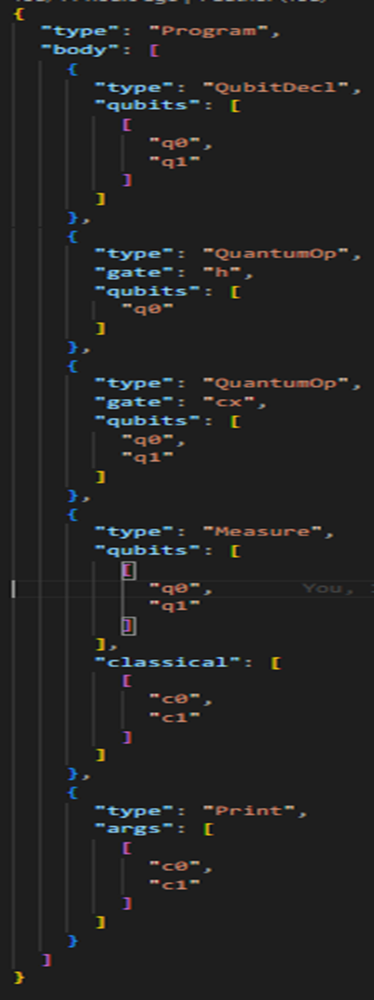

# Abstract Syntax Tree (AST) Output

The Abstract Syntax Tree (AST) is a hierarchical representation of the QUCPL program's structure, generated by parsing the source code using the Lark parser in Python. This section details the AST generation process and provides a sample AST output for the Bell state program, as implemented during Week 3 of the internship.

## AST Generation Process

The AST is created using the following steps:

Source Code Parsing: The QUCPL source code is parsed using a grammar defined in grammar.lark with the Lark parsing library.

Tree Transformation: A Transformer class processes the parse tree to produce a simplified AST, which is structured for further compilation into an Intermediate Representation (IR).

JSON Serialization: The AST is saved as a JSON file (ast.json) for compatibility with downstream tools like the compiler and simulator.

## Example Program: Bell State in QuCPL

Declares two qubits (q0, q1) initialized in the ( |0\rangle ) state.

Applies a Hadamard gate (h) to q0, creating a superposition.

Applies a CNOT gate (cx) with q0 as control and q1 as target, entangling the qubits.

Measures both qubits into classical bits c0 and c1.

Expected Output:

• Since the qubits are in a Bell state, the result will always be correlated.

• Either 00 or 11, each with 50% probability.

Sample AST Output (ast.json): The successful parsing and AST generation validates the correctness of both the language design and the parser implementation.

## Explanation of AST Structure

type: "program": The root node, encapsulating the entire program.

body: A list of statements, each representing a QUCPL construct:

qubit_decl: Declares qubits (q0, q1).

gate: Specifies gate operations (h, cx) with their arguments.

measure: Maps qubit measurements to classical bits.

This AST validates the correctness of the parser and serves as input for the IR generation phase.
