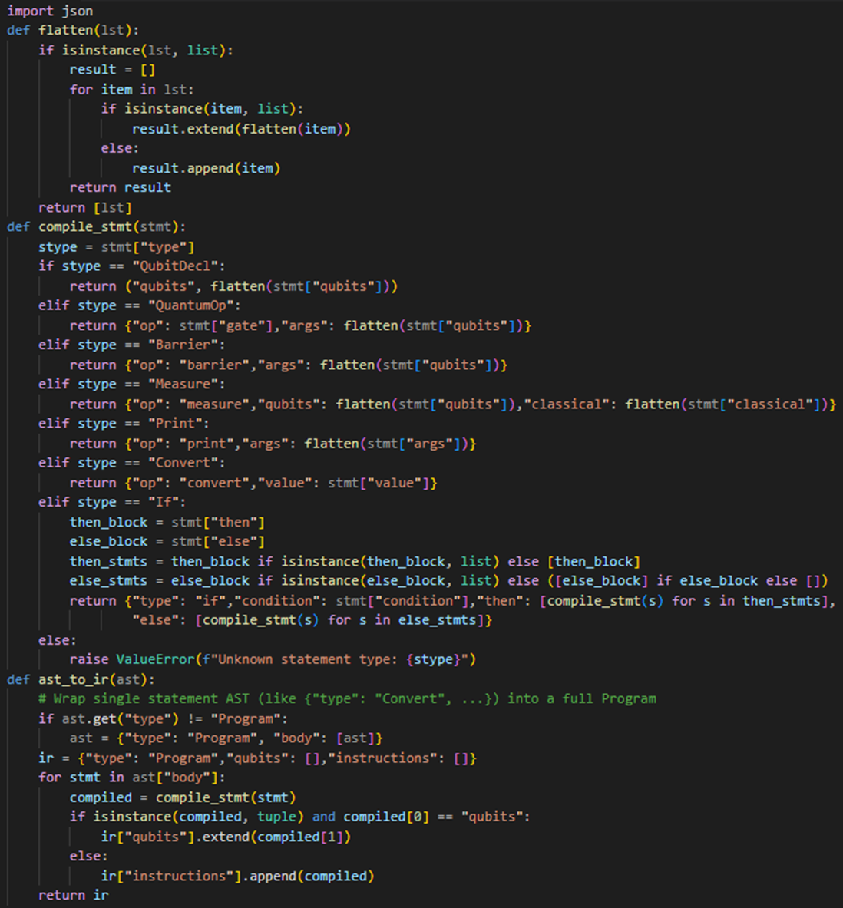

# Compiler

The compiler is a crucial component of the QUCPL (Quantum Computing Programming Language) project. It transforms the high-level quantum programs written in QuCPL into a structured, low-level format that can be executed on quantum hardware or simulators. Specifically, the compiler takes the Abstract Syntax Tree (AST) generated by the parser and converts it into an Intermediate Representation (IR), which is a JSON-based format designed to be backend-agnostic and easy to process.

## Introduction to the Compiler

The compiler serves as the bridge between the user-friendly syntax of QuCPL and the operational instructions needed for quantum computation. Its primary responsibilities include:

Traversing the AST to identify and process different types of statements (e.g., gate operations, measurements, conditionals).

Converting each statement into a corresponding instruction in the IR.

Managing declarations of qubits and classical bits.

Handling control flow constructs such as if statements.

Performing basic validation to ensure the program’s semantic correctness.

By generating a standardized IR, the compiler enables QuCPL programs to be translated into various backend formats, such as Qiskit circuits, for simulation or execution.

## Compiler Implementation

The compiler is implemented in the compiler.py script, which contains several key functions to transform the AST into IR.
Main Functions

ast_to_ir(ast):
Initializes the IR structure with empty lists for qubits, classical bits, instructions, and control flow.
Processes each statement in the AST:
Adds qubit and classical bit declarations to the respective lists.
Uses compile_stmt to convert other statements into IR instructions.

compile_stmt(stmt):
Handles individual statements by matching their type (e.g., gate, measure, if, print).
Returns the corresponding IR instruction object.

flatten(args):
A utility function that ensures arguments (e.g., qubit lists) are flattened into a single array, as required by the IR schema.

## Compilation Process

Initialization: Create an empty IR structure.

Declaration Handling: Add declared qubits and classical bits to the IR.

Statement Compilation: For each statement in the AST.

Use compile_stmt to generate the appropriate IR instruction.

Append the instruction to the "instructions" list.

Control Flow: If control flow statements are present, compile them into the "control_flow" field.

This structured approach ensures that the entire program is accurately represented in the IR.

## Handling Different Statement Types

The compiler supports various statement types, each requiring specific handling:

### Gate Operations

Example: h q0; or cx q0, q1;

Compilation:

Extract the gate name and qubit arguments.

Flatten the arguments using flatten.

Create an instruction: {"type": "gate", "name": "h", "args": ["q0"]}

### Measurements

Example: measure q0 -> c0;

Compilation:

Identify the qubit to measure and the target classical bit.

Create an instruction: {"type": "measure", "qubit": "q0", "target": "c0"}

### Conditional Statements

Example: if (c0 == 1) { x q2; }

Compilation:

Process the condition and the nested block.

Recursively compile the inner statements.

Nest the compiled instructions within a control flow block in the IR.

### Print Statements

Example: print c0;

Compilation:

Identify the variables or literals to print.

Create an instruction: {"type": "print", "args": ["c0"]}

Each statement type is handled by a specific case in the compile_stmt function, ensuring accurate translation to IR.

The resulting IR is a JSON object ready for simulation or execution.

## Error Handling and Validation

The compiler includes basic error handling and validation to ensure program correctness:

Undeclared Variables: Raises an error if a qubit or classical bit is used without declaration.

Invalid Gate Arguments: Detects and reports if a gate is applied with the wrong number of arguments (e.g., cx q0; instead of cx q0, q1;).

Type Mismatches: Ensures measurements are performed on qubits and stored in classical bits.

These checks help catch common mistakes early, improving the reliability of QuCPL programs.
