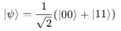

# ENTANGLEMENT AND QUANTUM INFORMATION

## ENTANGLEMENT

• Quantum entanglement is a physical phenomenon where two or more qubits become linked in such a way that the state of one instantly influences the state of the other —no matter the distance between them.

• If qubits A and B are entangled, measuring A collapses the state of B—even if B is far away.

• Qubits are perfectly correlated

• An entangled state cannot be written as: ∣ψ⟩=∣ψ1⟩⊗∣ψ2⟩

• Instead, it's a non-separable superposition of multiple states: ∣ψ⟩=α∣00⟩+β∣11⟩

• Used in Quantum teleportation, QKD, superdense coding.

• Example: Bell State 

Properties of Bell States

• Maximal Entanglement: Measurement of one qubit immediately determines the state of the other, regardless of distance.

• Orthogonality: All Bell states are mutually orthogonal: ⟨Φ+∣Φ−⟩=0,⟨Ψ+∣Ψ−⟩=0

• Completeness: They form a complete basis for two-qubit states, meaning any two-qubit state can be expressed as a combination of Bell states.

Applications of Bell States

• Quantum Teleportation: Used as the entangled resource shared between Alice and Bob.

• Superdense Coding: Sends 2 classical bits using 1 qubit.

• Entanglement-based Quantum Key Distribution: Ensures secure communication using Bell inequality violations.

• How to Create Entanglement between two qubits:

1.Apply a Hadamard gate to qubit 0 to create superposition.

2.Apply a CNOT gate from qubit 0 (control) to qubit 1 (target).

• Below is the code for entanglement, output circuit and the results :

## QUANTUM TELEPORTATION

Quantum teleportation is a protocol that enables the transfer of a quantum state from one qubit (held by Alice, the sender) to another distant qubit (held by Bob, the receiver), using a combination of quantum entanglement and classical communication. Notably, the qubit itself is not physically transmitted; instead, its exact state is recreated on Bob’s qubit.

1.Initial Setup

• Alice possesses a qubit in an unknown quantum state, denoted as:   ∣ψ⟩=α∣0⟩+β∣1⟩

• Alice and Bob share an entangled pair of qubits, labelled Qubit 1 and Qubit 2, prepared in the Bell state: ∣Φ+⟩=12(∣00⟩+∣11⟩)

• Qubit 0: Alice's message qubit

• Qubit 1: Alice's part of the entangled pair

• Qubit 2: Bob's part of the entangled pair

• Alice can send 2 classical bits(from her measurement) to Bob through a classical channel.

2.Entangle & Measure (Alice's Operations)

• Apply a CNOT gate with Qubit 0 (control) and Qubit 1 (target).

• Apply a Hadamard gate to Qubit 0.

• Measure Qubits 0 and 1 in the computational basis.

• Send the 2-bit measurement result to Bob via classical communication.

3.Bob's Correction (Based on Alice's Measurement)

•  Upon receiving Alice’s two classical bits, Bob applies a conditional quantum gate to Qubit 2:

Alice’s Measurement  Bob’s Operation
00                     None
01                   X (bit-flip)
10                   Z (phase-flip)
11                   Z followed by X

• After the correction, Bob’s qubit (Qubit 2) exactly reproduces the original quantum state ∣ψ⟩.

Key Observations:

• The quantum state is destroyed on Alice's side after measurement — she no longer holds ∣ψ⟩|.

• This is consistent with the no-cloning theorem: a quantum state cannot be copied, only transferred.

• Teleportation thus requires: A shared entangled pair, Classical communication of 2 bits, Local quantum operations by Bob.

• Code snippet and the measured results are shown below :

