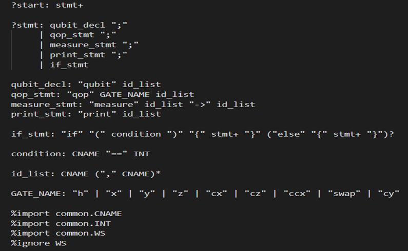

# Grammar Specification using Lark (PEG)

The QUCPL grammar was defined using Lark's PEG syntax in a file named grammar.lark.

This grammar specifies the rules for valid QUCPL programs, including qubit declarations, gate operations, measurements, and comments.

## Key Features

Qubit Declarations: Syntax like qubit q0, q1; declares one or more qubits.

Gate Operations: Supports single-qubit gates (h, x, y, z, rx, ry, rz) and multi-qubit gates (cx), e.g., h q0; or cx q0, q1;.

Measurement: Syntax like measure q0 -> c0; measures a qubit and stores the result in a classical bit.

Comments: Lines starting with // are ignored, enhancing code readability.

Extensibility: The grammar is designed to support future additions like control flow (if, loop) and custom gates.

## The grammar uses Lark’s conventions

WS ignores whitespace for cleaner parsing.

Comments are ignored during parsing but preserved for documentation.

IDENTIFIER supports alphanumeric names for qubits and classical bits.
