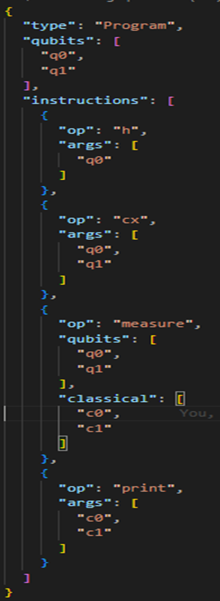

# Intermediate Representation (IR) Output

The Intermediate Representation (IR) is a backend-agnostic, JSON-based format that captures the logic of a QUCPL program after parsing and compilation. This section outlines the IR design and provides a sample IR output for the Bell state program, as implemented during Week 4 of the internship.

## IR Design Principles

The IR was designed to be:

Readable: JSON format for easy inspection and debugging.

Structured: Separates quantum instructions, qubit declarations, and control flow.

Extensible: Supports future constructs like loops and conditionals.

Backend-Agnostic: Compatible with Qiskit, OpenQASM, or custom simulators.

For IR schema you can see detailed in ir_schema.

## IR Generation Process

The IR is generated using compiler.py, which:

Traverses the AST produced by the parser.

Converts each AST node into corresponding IR components using compile_stmt().

Flattens nested arguments (via flatten()) to ensure compatibility with the IR schema.

Saves the result as a JSON file (e.g., bell_ir.json).

## Sample IR Output: Bell State

Using the same Bell state program from the AST example we get resulting IR, saved as bell_ir.json, is shown below :

## Explanation of IR Structure

qubits: Lists all declared qubits (q0, q1).

classical: Lists classical bits for measurement outputs (c0, c1).

instructions: A sequence of operations:-

gate: Specifies quantum gates (h, cx) with their arguments. complexes.  - measure: Maps qubits to classical bits for measurement.

control_flow: Empty in this case, as the Bell state program lacks conditional statements.

## Role of IR in QUCPL

The IR serves as a bridge between the parsed AST and the execution backend (e.g., Qiskit).

It enables:

Visualization: Circuit diagrams generated from IR using visualize.py.

Simulation: Execution on Qiskit’s Aer simulator via simulator.py.

Extensibility: Future support for advanced protocols and control structures.

The successful generation of bell_ir.json validated the compiler’s ability to produce a structured, executable representation of QUCPL programs.
