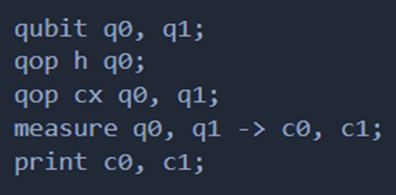

# Defining a Custom Language for Quantum Computing

Building on the conceptual and practical insights gained in Week 1, Week 2 marked the transition from using an existing quantum toolkit (Qiskit) to creating a custom quantum programming language—named QuCPL (Quantum Computing Programming Language). This language is designed to allow developers to write high-level, human-readable quantum code that can be translated into backend instructions for execution or simulation.

## The motivation behind designing QuCPL stems from the need for: a

• A readable and intuitive syntax for expressing quantum operations.

• Abstraction over complex circuit-level programming.

• Integration with existing quantum toolkits like Qiskit through an intermediate representation.

## Example Program: Bell State in QuCPL

To validate the language and parser, a Bell state program was written in QuCPL syntax:

• Declares two quantum bits (qubits): q0 and q1.

• These are initialized in the |0⟩ state by default.

• Applies the Hadamard gate (H) to q0.

• This transforms q0 into a superposition state.

• Applies the Controlled-NOT (CNOT) gate: Control: q0 and Target: q1

• This entangles q0 and q1.

• After this, the qubits are in the Bell state:  

• Measures qubits q0 and q1.

• Stores the results in classical bits c0 and c1.

• Outputs the measurement results of c0 and c1.
