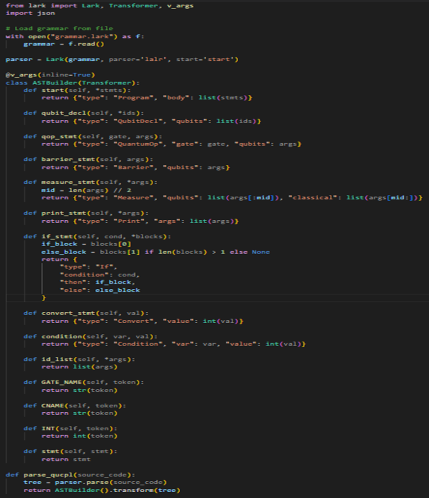

# Parser Implementation

This section details the design and implementation of the parser for the Quantum Computing Programming Language (QUCPL), a critical component developed during Week 3 of the internship at Quinfo Systems Pvt. Ltd, Hyderabad. The parser transforms QUCPL source code into an Abstract Syntax Tree (AST), enabling further compilation and execution. Built using Lark, a Python-based parsing library, the parser leverages a Parsing Expression Grammar (PEG) to define QUCPL's syntax, ensuring robust and accurate processing of quantum programs.

## Objectives

The goals for the parser implementation, as outlined in the internship report, were:

Define a formal grammar for QUCPL using Lark's PEG syntax.

Implement a parser in Python to process QUCPL code and produce an AST.

Test the parser with a sample quantum program (e.g., Bell state).

Save the AST as a JSON file for compatibility with subsequent compilation stages.

## Key Components

• Parser Initialization: The parser is initialized with the Lark grammar file and configured to use the lalr parsing algorithm for efficiency.

• AST Builder (Transformer): The ASTBuilder class, a subclass of Lark’s Transformer, walks the parse tree and constructs a simplified AST.

• Main parser function: Parses the code to get a parse tree and then transforms it into an AST using ASTBuilder.

• Main function:Reads multiple lines of user input for the program code. Stops when the user enters a blank line. Parses the user’s code into an AST and saves it to Json format.

## Expected Output

The parser successfully validates the syntax.

The AST reflects the program’s structure: qubit declarations, Hadamard gate, CNOT gate, measurements, and a comment.

The output is saved as ast.json, ready for the compiler to generate an Intermediate Representation (IR).

The QUCPL parser, built with Lark and Python, successfully transforms quantum source code into a structured AST, enabling further compilation and execution. Its design reflects a balance between simplicity, robustness, and extensibility, making it a vital part of the QUCPL toolchain. The successful parsing of the Bell state program demonstrates its correctness and sets the stage for advanced quantum protocols like teleportation.
