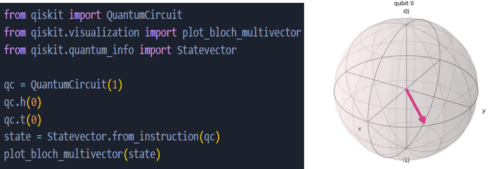

# Quantum Foundations

The first week of the internship focused on building a strong foundation in quantum computing concepts while gaining hands-on experience with the Qiskit framework developed by IBM. The specific learning objectives for this phase were:

• To understand the principles of quantum mechanics relevant to computing, such as superposition, entanglement, measurement, and quantum gates.

• To explore how quantum information is represented using qubits and how quantum logic gates manipulate quantum states.

• To get familiar with Qiskit’s environment, syntax, and tools for creating and simulating quantum circuits.

• To implement a basic quantum program—namely, the Bell state circuit—as a proof of concept.

• To produce a short technical report titled “What is a Qubit?” for reinforcing understanding and documentation.

## Introduction to QUANTUM COMPUTING

• Quantum Computing is a field of computing that uses the principles of quantum mechanics—the physics of subatomic particles—to process information.

• Instead of bits, it uses qubits, which can exist in multiple states at once due to quantum phenomena like superposition and entanglement.

• Quantum Computing uses the laws of quantum mechanics to enable massive parallelism and new ways to solve complex problems  that are currently infeasible for classical computers.

• Can evaluate many possibilities simultaneously.

• Offers exponential speedups for certain tasks.

• Outputs are probabilistic, not fixed, and require multiple runs to determine likely results.

• Classical Bit: 0 and 1     Quantum Qubit: |ψ⟩= α|0⟩+ β|1⟩ (α and β are complex numbers, |α|² + |β|² = 1)

• Applications of Quantum Computing : Cryptography, Simulating molecules and interactions, AI & ML models, Optimization, etc.

## Qubit

The Building Block of Quantum Computing

A qubit (quantum bit) is the basic unit of quantum information, distinct from a classical bit. Unlike a classical bit, which is either 0 or 1, a qubit can exist in a superposition of both states at once, enabling quantum computers to tackle certain problems far more efficiently than classical systems.

The state of a qubit is expressed mathematically as: |ψ⟩= α|0⟩+ β|1

where:
alpha, beta are complex probability amplitudes.

( |α|^2 ) and ( |β|^2 ) represent the probabilities of measuring 0 or 1, respectively.

The condition ( |α|^2 + |β|^2 = 1 ) ensures normalization.

## Bloch Sphere

Visualizing Qubits

The Bloch sphere offers a visual representation of a qubit’s state, aiding in the comprehension of quantum operations.

Coordinates: A Bloch vector  defines the qubit’s state.

Angles: theta, polar, and phi (azimuthal) position the state on the sphere.

This tool is invaluable for visualizing how quantum gates manipulate qubit states through rotations.

## Quantum Gates and Circuits

Quantum gates, the counterparts to classical logic gates, are unitary operations that manipulate qubits reversibly.

Common Quantum Gates:

Hadamard Gate (H): Generates superposition.

Pauli-X Gate (X): Flips the qubit state (e.g., ( |0\rangle ) to ( |1\rangle )).

Pauli-Y Gate (Y): Rotates the state by π radians around the Y-axis.

Pauli-Z Gate (Z): Introduces a phase flip, altering the sign of ( |1\rangle ).

CNOT Gate: Flips the target qubit based on the control qubit’s state.

These gates are critical for building quantum circuits and were integrated into QUCPL.

Example:

Bell State Circuit in Qiskit
Below is a Qiskit implementation of a Bell state circuit to illustrate entanglement:

Steps Explained:

Hadamard Gate: Creates superposition on qubit 0.

CNOT Gate: Entangles qubits 0 and 1.

Measurement: Yields outcomes 00 or 11 with equal probability, confirming entanglement.

## Example codes

## Summary

The concepts of qubits, superposition, entanglement, and quantum gates form the bedrock of quantum computing and QUCPL’s functionality. Practical examples like the Bell state circuit demonstrate how these principles translate into real-world applications, paving the way for deeper quantum programming advancements.
