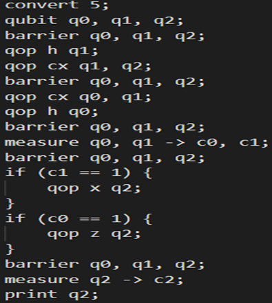
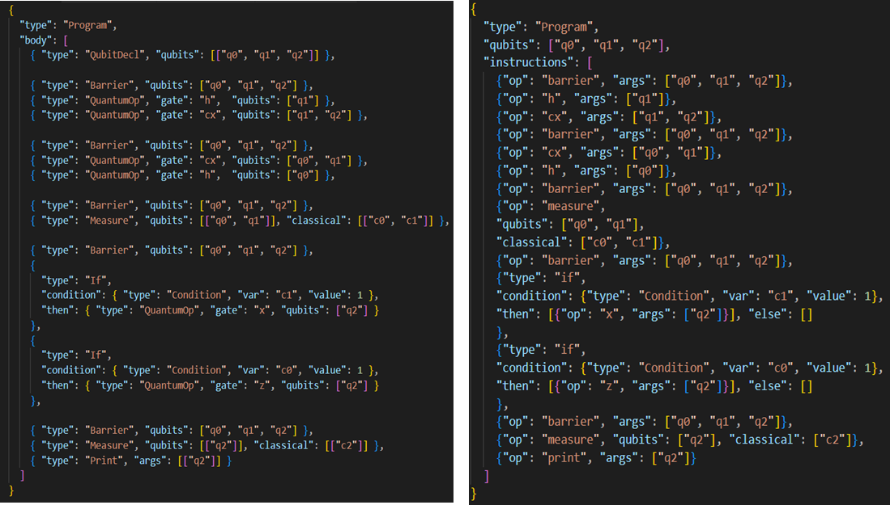
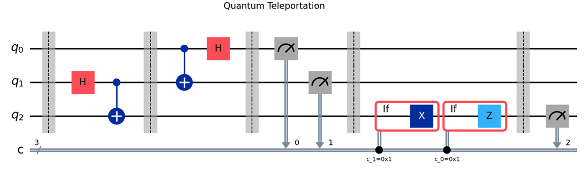
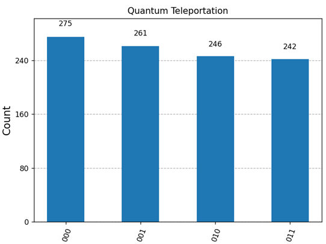
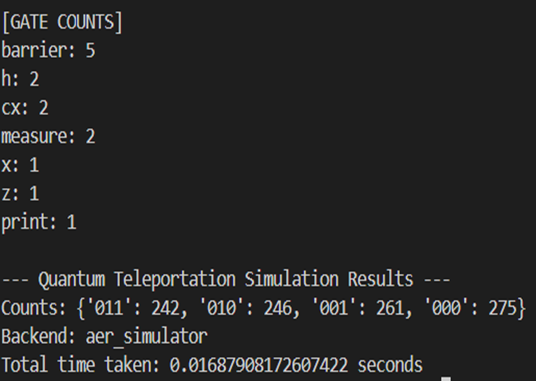

# Teleportation Protocol in QUCPL

## Overview

This protocol tests QUCPL’s ability to manage quantum gate logic, classical communication, and conditional execution. The week focused on integrating all components developed in prior weeks—parsing, Abstract Syntax Tree (AST) and Intermediate Representation (IR) generation, backend integration, circuit visualization, and simulation—into a robust pipeline capable of executing complex quantum protocols. This effort validated QUCPL’s potential for applications in quantum communication and cryptography.

## Theoretical Background

Quantum teleportation enables the transfer of a quantum state from one qubit to another without physical transmission, leveraging entanglement and classical communication. It adheres to the no-cloning theorem, ensuring the original state is destroyed during the process. The protocol, as implemented in QUCPL, involves:

Qubit Setup: Qubit q0 holds the input state Alice’s message qubit. Qubits q1 and q2 form an entangled pair shared between Alice q1 and Bob q2.

Entanglement Stage: A Hadamard gate H on q1 creates superposition, followed by a CNOT gate between q1 control and q2 target, producing a Bell state.

Bell Measurement: Alice applies a CNOT gate with q0 as control and q1 as target, followed by a Hadamard gate on q0 . Both q0 and q1 are measured into classical bits c0 and c1, collapsing their states and generating two classical bits.

Conditional Recovery:

Bob uses the classical bits ( c0 ) and ( c1 ) to apply corrective gates to ( q2 ):

( c0 = 0, c1 = 0 ): No correction.

( c0 = 0, c1 = 1 ): Apply ( X ) gate (bit-flip).

( c0 = 1, c1 = 0 ): Apply ( Z ) gate (phase-flip).

( c0 = 1, c1 = 1 ): Apply ( Z ) followed by ( X ).

These corrections reconstruct the original state on ( q2 ).

Final Measurement: Bob measures ( q2 ) into classical bit ( c2 ) to verify the teleported state matches ( q0 )’s initial state.

This process relies on entanglement as a resource and two classical bits for communication, making it a cornerstone of quantum information protocols.

## Implementation in QUCPL

The teleportation protocol was implemented in QUCPL using a clear, modular syntax in the teleportation.qucpl program. Key components include:

Qubit and Classical Bit Declarations:

Qubits: qubit q0, q1, q2;

Classical bits: c0, c1, c2 for measurements and control.

Entanglement Creation:

Apply h q1; to put ( q1 ) in superposition.

Apply cx q1, q2; to entangle ( q1 ) and ( q2 ).

Bell Measurement:

Apply cx q0, q1; and h q0;.

Measure: measure q0 -> c0; measure q1 -> c1;.

Conditional Corrections:

Use conditional statements like:

if (c0 == 0 && c1 == 1) { x q2; }

if (c0 == 1 && c1 == 0) { z q2; }

if (c0 == 1 && c1 == 1) { z q2; x q2; }

Final Measurement and Output:

Measure: measure q2 -> c2;.

Log results using print operations.

This implementation highlights QUCPL’s ability to express complex quantum protocols in a readable, high-level syntax, suitable for educational and practical applications.

## AST and IR Generation

The teleportation.qucpl source code was processed through QUCPL’s pipeline:

Parsing: parser.py generated an AST (tele_ast.json), capturing the program’s structure.

Compilation: compiler.py transformed the AST into an IR (tele_ir.json), which includes:

    Gate Operations: Hadamard, CNOT, Pauli-X, Pauli-Z.

    Barriers: To separate logical phases (entanglement, measurement, correction).

    Measurements: Mapping q0, q1, and q2 to c0, c1, and c2.

    Control Flow: Conditional if blocks for corrections based on c0 and c1.

    Print Operations: For logging results.

The IR’s consistency with QUCPL’s schema confirmed the language’s extensibility for quantum-classical control flow, enabling seamless integration with the simulation backend.

## Visualization

The IR (tele_ir.json) was used to generate a circuit diagram via Qiskit and Matplotlib, visualizing the teleportation protocol’s structure:

    Entanglement of q1 and q2 (Hadamard and CNOT).

    Bell measurement on q0 and q1 (CNOT, Hadamard, measurements).

    Conditional corrections on q2 (X and Z gates).

    Final measurement of q2.

This diagram confirms the logical flow and correctness of the implementation.

## Simulation Results

The simulation was executed using Qiskit’s Aer simulator with 1024 shots, handling conditional execution, measurement mapping, and runtime logging.

Key details include:

    Backend: Qiskit Aer simulator.

    Parameters: 1024 shots for probabilistic outcomes.

    Results:Measurement of c2 showed a nearly even distribution of 0 and 1, indicating successful teleportation of a superposed state from q0 to q2.

The histogram visualized this distribution, confirming expected quantum behavior.

Runtime Logs:

Included gate counts (e.g., number of h, cx, x, z), execution time, and classical bit values.

These results validated QUCPL’s pipeline, from source code to simulation output.

## Runtime error handling

The runtime robustness was significantly improved. The simulator backend was extended to include:

• Gate Argument Checks: Each operation now validates the number of arguments (e.g., cx must have 2).

• Name Resolution: Catches undefined qubit or classical bit references.

• Safe Fallbacks: Invalid instructions are logged and skipped without crashing the pipeline.

• Gate Usage Logging: Shows total use of each gate type per program.

Error Examples:

• [ARGUMENT ERROR] Gate 'cx' expects 2 arguments.

• [RUNTIME ERROR] Unknown qubit 'q3' in instruction: {...}

• [SIMULATION ERROR] Backend unavailable.

These mechanisms ensured smoother development and testing, especially as the language grows to support more complex logic.

## Conclusions

Implementing quantum teleportation in QUCPL demonstrated the language’s capability to handle sophisticated quantum protocols involving entanglement, measurement, and classical control. The precise ordering of gates and integration of quantum-classical logic tested QUCPL’s robustness, while runtime validation and error handling enhanced reliability. This milestone paves the way for future applications, such as Quantum Key Distribution, and underscores QUCPL’s potential as an educational and practical tool for quantum computing.
