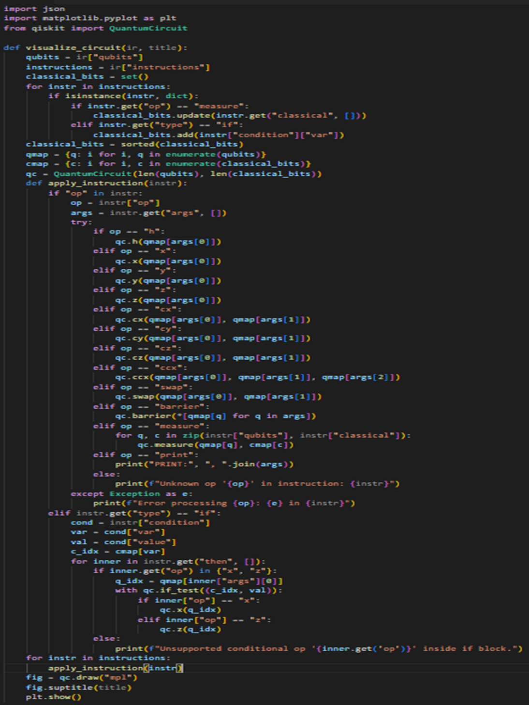
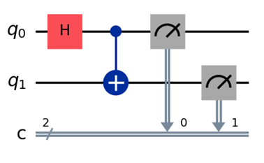

# Circuit Visualization in QUCPL

Circuit visualization is a critical component of the QUCPL (Quantum Computing Programming Language) project, enabling users to inspect and debug quantum programs by rendering their circuit representations. The visualization tool transforms the Intermediate Representation (IR) of a QUCPL program into a visual quantum circuit diagram using Qiskit and Matplotlib, making the program’s logic tangible and intuitive.

## Overview

The visualization module, implemented in the visualize.py script, bridges the gap between the abstract code written in QUCPL and the concrete quantum circuits executed on backends like Qiskit’s Aer simulator.

The primary goals of the visualization pipeline are:

Render Quantum Circuits: Generate clear, accurate circuit diagrams from the IR.

Support Debugging: Help developers verify the correctness of their programs by visualizing gate operations, measurements, and qubit interactions.

Enhance Usability: Provide a visual feedback loop that makes QUCPL accessible to both beginners and advanced users.

The visualization process is integrated into the QUCPL toolchain, taking the JSON-based IR (e.g., bell_ir.json) generated by the compiler and producing a circuit diagram that matches the intended quantum logic.

## Visualization Pipeline

The visualization pipeline involves the following steps:

Load the IR: The visualize.py script reads the JSON-based IR file, which contains the program’s structure, including qubit declarations, gate operations, measurements, and control flow.

Map Qubits and Classical Bits: The script maps qubit and classical register names from the IR to Qiskit’s indexing system, ensuring compatibility with Qiskit’s QuantumCircuit object.

Apply Operations: It iterates through the IR’s instruction list, applying each operation (e.g., Hadamard, CNOT, measurement) to the circuit.

Render the Circuit: Using Qiskit’s visualization tools and Matplotlib, the script generates a graphical representation of the circuit.

Handle Errors: Unrecognized operations or invalid inputs are logged to aid debugging without crashing the pipeline.

This pipeline ensures that QUCPL programs, such as the Bell state or quantum teleportation circuits, are visually represented in a way that aligns with their logical structure.

## Implementation Details

The visualize.py script is a key deliverable from Week 4, designed to work seamlessly with the IR schema defined in ir_schema_docs.md. Below is the core implementation, adapted from the internship report’s description:

visualize.py:

This script:

Loads the IR: Reads a JSON file (e.g., bell_ir.json) and parses it into a Python dictionary.

Builds the Circuit: Creates a Qiskit QuantumCircuit object, mapping qubits and classical bits, and applies operations like h (Hadamard), cx (CNOT), and measure.

Renders the Diagram: Uses Qiskit’s draw method with Matplotlib to generate and display the circuit diagram, optionally saving it to a file.

## Example: Visualizing the Bell State Circuit

To validate the visualization tool, the Bell state program was used as a test case. The program, written in QUCPL syntax, declares two qubits (q0, q1), applies a Hadamard gate to q0, a CNOT gate from q0 to q1, and measures both qubits into classical bits (c0, c1).

The IR for this program is in bell_ir.json, see IR section.

Running visualize.py on bell_ir.json produces the following circuit diagram:

The diagram shows:

A Hadamard gate (H) on q0, creating a superposition.
A CNOT gate (CX) from q0 (control) to q1 (target), entangling the qubits.
Measurements of q0 and q1 into classical bits c0 and c1.

This output matches the expected logic of the Bell state, confirming the correctness of the visualization pipeline.
Integration with QUCPL Toolchain

This integration allows users to write QUCPL code, compile it to IR, and immediately visualize the resulting circuit, closing the feedback loop for program development and debugging.

## The current visualization tool is functional but can be improved

Interactive Visualizer: Develop a web-based interface for drag-and-drop circuit editing using libraries like D3.js or Plotly.

Extended Gate Support: Add visualization for additional gates (e.g., rx, ry, rz) and custom multi-qubit gates.

Real-Time Feedback: Integrate visualization directly into the QUCPL IDE or GUI for immediate circuit previews during coding.

The visualization module is a cornerstone of QUCPL’s usability, transforming abstract code into intuitive circuit diagrams. By leveraging Qiskit and Matplotlib, it provides a powerful tool for debugging, education, and presentation. The successful visualization of the Bell state circuit demonstrates the module’s effectiveness, and its integration with the broader QUCPL toolchain sets the stage for further advancements in quantum programming.
